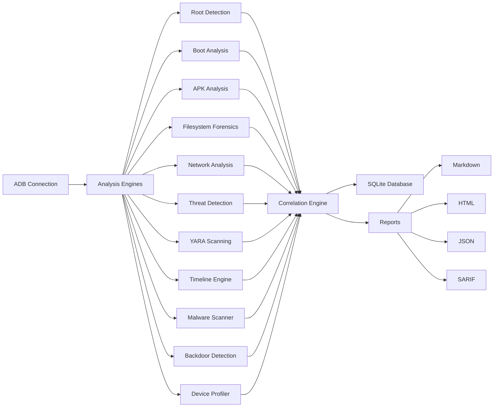
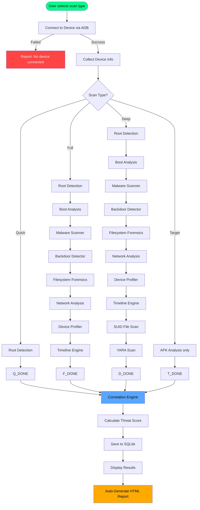
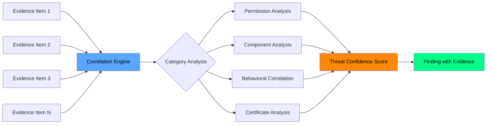
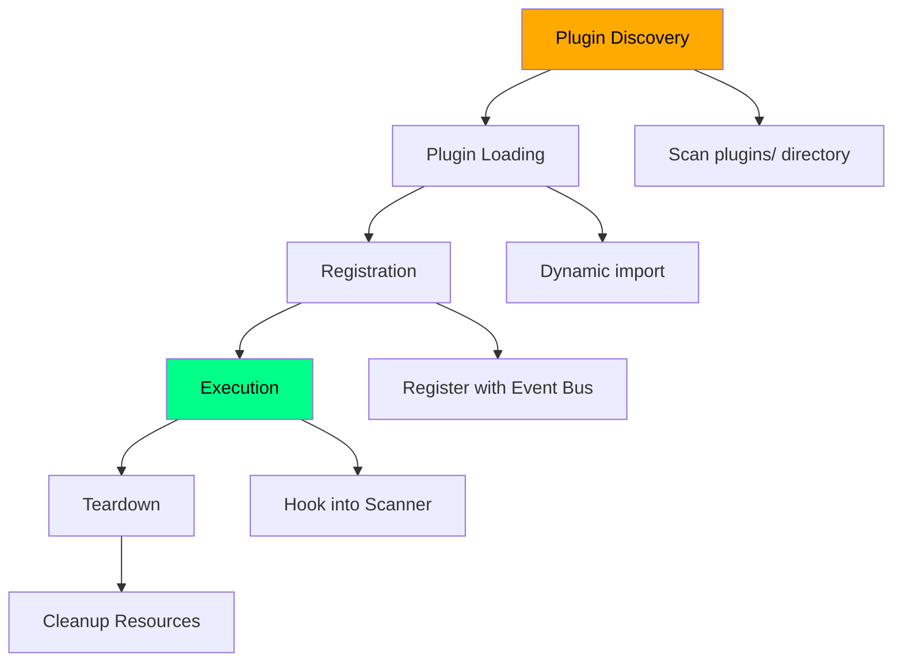

<div align="center">

```
    _                    _     _             ____               _     _
   / \   _ __   __ _  __| |   (_)_ __   ___|  _ \ _   _ ______| |__ | |__   ___
  / _ \ | '_ \ / _` |/ _` |   | | '_ \ / _ \ | | | | | |_  /| '_ \| '_ \ / _ \
 / ___ \| | | | (_| | (_| |   | | | | |  __/ |_| | |_| |/ / | |_) | | | |  __/
/_/   \_\_| |_|\__,_|\__,_|___|_|_| |_|\___|____/ \__,_/___|_|_.__/|_| |_|\___|
                   |_____|         Advanced Android Security & Forensics
```

# AegisDroid

**Advanced Android Security, Threat Hunting & Digital Forensics Framework**

*Defensive security platform for Android devices — evidence-based, forensically sound, and privacy-respecting.*

[](LICENSE)
[](https://python.org)
[](https://android.com)
[](#)
[](https://github.com/aegisdroid/aegisdroid/actions/workflows/ci.yml)
[](#cli-commands)
[](#yara-engine)
[](#digital-forensics)
[](#adb-adapter)
[](#threat-correlation-engine)
[](https://github.com/sindresorhus/awesome-security)

</div>

---

<div align="center">

```
╔══════════════════════════════════════════════════════════════════╗
║                                                                  ║
║   🔒  AegisDroid — Where every byte tells a story.              ║
║                                                                  ║
║   Build trust. Audit devices. Hunt threats. Reconstruct truth.  ║
║                                                                  ║
╚══════════════════════════════════════════════════════════════════╝
```

</div>

---

## ▸ Animated Terminal Preview

```
┌─────────────────────────────────────────────────────────────────────┐
│  ╔═╗╦═╗╦╔═╗╔╗╔╔═╗╦═╗  ╦ ╦╔╗╔╦╔╗╔╔═╗╔╦╗╔═╗╦  ╦  ╔═╗╦═╗╔═╗╔╗╔   │
│  ║  ╠╦╝║╠═╣║║║║╣ ╠╦╝  ║ ║║║║║║║║╚═╗ ║ ╠═╣║  ║  ║╣ ╠╦╝║╣ ║║║   │
│  ╚═╝╩╚═╩╩ ╩╝╚╝╚═╝╩╚═  ╚═╝╝╚╝╩╝╚╝╚═╝ ╩ ╩ ╩╩═╝╩═╝╚═╝╩╚═╚═╝╝╚╝   │
│                                                                  │
│  [$] aegis                                                       │
│                                                                  │
│  ┌─ AegisDroid v0.1.0 ──────────────────────────────────────┐    │
│  │                                                           │    │
│  │   1. Quick Scan        11. AI Assistant      ◄            │    │
│  │   2. Full Scan         12. Search Findings               │    │
│  │   3. Deep Scan         13. Live Monitor                   │    │
│  │   4. App Analysis      14. Diff Scans                    │    │
│  │   5. APK Analysis      15. Plugin Manager                │    │
│  │   6. Threat Hunt       16. Generate Report               │    │
│  │   7. Root Detection    17. List Past Scans               │    │
│  │   8. Boot Analysis     18. Install Requirements          │    │
│  │   9. Filesystem Check  19. System Info                   │    │
│  │  10. Network Analysis  20. About                         │    │
│  │                                                           │    │
│  └───────────────────────────────────────────────────────────┘    │
│                                                                  │
│  [$] 2                                                           │
│                                                                  │
│  ⣿ Connecting to device and scanning...                           │
│                                                                  │
│  ╭──────────────────────────── Scan Summary ───────────────────╮  │
│  │ Threat Confidence Score: 53%                                │  │
│  │ Risk Level: HIGH — Prompt investigation recommended         │  │
│  │ Findings: 12 total | Critical: 1 | High: 3 | Medium: 5    │  │
│  ╰─────────────────────────────────────────────────────────────╯  │
│                                                                  │
│  ╭──────────────────────────── Device Info ────────────────────╮  │
│  │ Model: Xiaomi miel                                         │  │
│  │ Android: 16 (SDK 36)                                       │  │
│  │ Build: google/frankel_beta/frankel:16/BP41.250916.015.A1  │  │
│  │ Security Patch: 2025-11-01                                 │  │
│  │ Rooted: Unknown                                            │  │
│  ╰─────────────────────────────────────────────────────────────╯  │
│                                                                  │
│  ╭──────────────────────────── Findings ───────────────────────╮  │
│  │ Sev      Category            Title                   Conf  │  │
│  │ ──────── ─────────────────── ─────────────────────── ────  │  │
│  │ CRITICAL Root                Magisk root detected    95%   │  │
│  │ HIGH     Xposed              Xposed framework found  88%   │  │
│  │ HIGH     Boot Tamper         AVB state locked        82%   │  │
│  │ MEDIUM   Filesystem          SUID binaries found     65%   │  │
│  │ MEDIUM   Network Anomaly     Suspicious DNS config   58%   │  │
│  ╰─────────────────────────────────────────────────────────────╯  │
│                                                                  │
│  Full report saved to: reports/report_device_20251201_143022.html │
│                                                                  │
└─────────────────────────────────────────────────────────────────────┘
```

---

## ▸ Screenshots

<div align="center">

| Terminal UI | Interactive Report | Threat Timeline |
|:-----------:|:------------------:|:---------------:|
|  |  |  |

| Threat Viewer | Plugin Manager | Device Profile |
|:-------------:|:--------------:|:--------------:|
|  |  |  |

</div>

---

## ▸ Table of Contents

<details>
<summary><strong>Navigation</strong></summary>

- [Introduction](#-introduction)
- [Features](#-features)
- [Architecture](#-architecture)
- [Directory Structure](#-directory-structure)
- [Installation](#-installation)
- [Quick Start](#-quick-start)
- [CLI Commands](#-cli-commands)
- [Configuration](#-configuration)
- [Scanning Pipeline](#-scanning-pipeline)
- [Threat Correlation Engine](#-threat-correlation-engine)
- [Root Detection](#-root-detection)
- [APK Analysis](#-apk-analysis)
- [YARA Engine](#-yara-engine)
- [Plugin SDK](#-plugin-sdk)
- [Reports](#-reports)
- [AI Assistant](#-ai-assistant)
- [Interactive Examples](#-interactive-examples)
- [Developer Guide](#-developer-guide)
- [Testing](#-testing)
- [Performance](#-performance)
- [Roadmap](#-roadmap)
- [Comparison](#-comparison)
- [Security Model](#-security-model)
- [FAQ](#-faq)
- [Troubleshooting](#-troubleshooting)
- [Contributing](#-contributing)
- [Code of Conduct](#-code-of-conduct)
- [Support](#-support)
- [Acknowledgements](#-acknowledgements)
- [License](#-license)

</details>

---

## ▸ Introduction

### What is AegisDroid?

AegisDroid is a **professional-grade Android security, threat hunting, and mobile forensics CLI framework** built in Python. It provides an interactive terminal-based interface for comprehensive device security analysis — from root detection to full filesystem forensics, from YARA-based malware scanning to timeline reconstruction.

### The Problem

Android security analysis today is fragmented. You need **one tool for root detection**, **another for APK analysis**, **a third for network forensics**, **a fourth for timeline reconstruction**, and **yet another for YARA scanning**. Each has its own interface, its own output format, its own quirks.

Security researchers, incident responders, and forensic analysts spend more time stitching tools together than actually analyzing devices.

### The Solution

AegisDroid unifies **14 specialized analysis engines** under a single, coherent CLI with an interactive numbered menu. One command. One interface. One report.



### Goals

| Goal | Description |
|------|-------------|
| **Unified** | Single CLI for all Android security analysis needs |
| **Forensic** | Evidence-based findings with confidence scores — never binary yes/no |
| **Extensible** | Plugin system, YARA rules, custom YAML conditions |
| **Interactive** | Numbered menu — no memorizing flags, no help pages |
| **Professional** | Hexagonal architecture, async event bus, SQLite persistence |
| **Private** | All analysis runs locally — zero telemetry, zero cloud dependency |

### Vision

AegisDroid aims to be the **Velociraptor of Android** — a single, fast, extensible platform that security professionals reach for when they need to understand what's happening on an Android device.

---

## ▸ Features

<table>
<tr><th>Module</th><th>Feature</th><th>Description</th><th>Status</th></tr>
<tr><td><strong>Core</strong></td><td>Interactive Menu</td><td>20-option numbered menu with split layout and centered ASCII banner</td><td>✅</td></tr>
<tr><td></td><td>Async Event Bus</td><td>25+ named events for scan lifecycle, device connection, findings</td><td>✅</td></tr>
<tr><td></td><td>Dependency Injection</td><td>Hexagonal architecture with abstract ports and adapters</td><td>✅</td></tr>
<tr><td></td><td>SQLite Persistence</td><td>Async SQLite for scans, findings, baselines, and timeline events</td><td>✅</td></tr>
<tr><td></td><td>YAML Configuration</td><td>Hierarchical config with ADB, YARA, report, and plugin sections</td><td>✅</td></tr>
<tr><td><strong>ADB</strong></td><td>Device Connection</td><td>Async ADB via subprocess — shell, pull, push, properties</td><td>✅</td></tr>
<tr><td></td><td>Device Profiling</td><td>26-section comprehensive device profile (OS, hardware, kernel, crypto, etc.)</td><td>✅</td></tr>
<tr><td></td><td>Package Management</td><td>List, query, and analyze installed packages</td><td>✅</td></tr>
<tr><td></td><td>Property Dump</td><td>Full `getprop` collection — 200+ system properties</td><td>✅</td></tr>
<tr><td><strong>Threats</strong></td><td>Root Detection</td><td>Magisk, KernelSU, APatch, BusyBox, OverlayFS detection</td><td>✅</td></tr>
<tr><td></td><td>Xposed Detection</td><td>Xposed, LSPosed, Riru, EdXposed detection</td><td>✅</td></tr>
<tr><td></td><td>Frida Detection</td><td>Frida server, frida-gadget, frida-agent detection</td><td>✅</td></tr>
<tr><td></td><td>Boot Analysis</td><td>AVB, DM-Verity, Verified Boot, rollback index analysis</td><td>✅</td></tr>
<tr><td></td><td>Malware Scanner</td><td>Known malware DB, suspicious patterns, dangerous permission combos</td><td>✅</td></tr>
<tr><td></td><td>Backdoor Detection</td><td>Persistence mechanisms, hidden dirs, bind mounts, debug props</td><td>✅</td></tr>
<tr><td></td><td>Crypto Miner Detection</td><td>Running process analysis for mining indicators</td><td>✅</td></tr>
<tr><td><strong>Forensics</strong></td><td>Filesystem Integrity</td><td>Root files, SUID binaries, suspicious executables, script detection</td><td>✅</td></tr>
<tr><td></td><td>Network Analysis</td><td>/proc/net/tcp parsing, DNS config, VPN detection, reputation scoring</td><td>✅</td></tr>
<tr><td></td><td>Timeline Engine</td><td>Boots, app installs, permissions, ADB events, USB events</td><td>✅</td></tr>
<tr><td></td><td>Hash Computation</td><td>SHA256/MD5/SHA1 for system files with baseline comparison</td><td>✅</td></tr>
<tr><td><strong>APK</strong></td><td>Static Analysis</td><td>Permissions, components, certificates, trackers, embedded URLs/IPs</td><td>✅</td></tr>
<tr><td></td><td>Tracker Detection</td><td>30+ known tracking SDKs identified by package signature</td><td>✅</td></tr>
<tr><td></td><td>Certificate Analysis</td><td>Debug, self-signed, weak key, expiration detection</td><td>✅</td></tr>
<tr><td></td><td>SBOM Generation</td><td>Software Bill of Materials from APK structure</td><td>✅</td></tr>
<tr><td><strong>YARA</strong></td><td>Rule Engine</td><td>File, directory, and APK scanning with zip entry support</td><td>✅</td></tr>
<tr><td></td><td>Default Rules</td><td>7 built-in rules: dynamic loading, debug build, root toolkit, Frida, etc.</td><td>✅</td></tr>
<tr><td></td><td>Custom Rules</td><td>Drop your own .yar files into rules/packs/</td><td>✅</td></tr>
<tr><td><strong>Plugins</strong></td><td>Plugin SDK</td><td>Discovery, loading, registration — extend AegisDroid with your own engines</td><td>✅</td></tr>
<tr><td></td><td>Plugin Lifecycle</td><td>init → register → execute → teardown</td><td>✅</td></tr>
<tr><td><strong>AI</strong></td><td>Ollama Integration</td><td>Local LLM analysis via Ollama — fully offline</td><td>✅</td></tr>
<tr><td></td><td>OpenAI Integration</td><td>Cloud LLM analysis for complex threat interpretation</td><td>✅</td></tr>
<tr><td><strong>Reports</strong></td><td>Markdown</td><td>Clean, portable Markdown reports</td><td>✅</td></tr>
<tr><td></td><td>HTML</td><td>Interactive dark-theme dashboard with tabs, filters, and charts</td><td>✅</td></tr>
<tr><td></td><td>JSON</td><td>Machine-readable structured output</td><td>✅</td></tr>
<tr><td></td><td>SARIF</td><td>Static Analysis Results Interchange Format for CI integration</td><td>✅</td></tr>
<tr><td><strong>CLI</strong></td><td>Interactive Menu</td><td>20-option numbered menu — no flags to memorize</td><td>✅</td></tr>
<tr><td></td><td>Subcommands</td><td>Direct CLI via `aegis scan`, `aegis apk`, `aegis hunt`, etc.</td><td>✅</td></tr>
<tr><td></td><td>Live Monitor</td><td>Real-time device monitoring with heartbeat alerts</td><td>✅</td></tr>
<tr><td></td><td>Diff Engine</td><td>Git-style scan comparison between two points in time</td><td>✅</td></tr>
<tr><td></td><td>Search Engine</td><td>Fuzzy search across all past scans and findings</td><td>✅</td></tr>
<tr><td><strong>DX</strong></td><td>Zero-Config</td><td>Works out of the box — no YAML editing required</td><td>✅</td></tr>
<tr><td></td><td>Package Resolution</td><td>Type `youtube` → auto-resolves to `com.google.android.youtube`</td><td>✅</td></tr>
<tr><td></td><td>Auto Reports</td><td>Full/deep scans auto-generate HTML reports to reports/</td><td>✅</td></tr>
</table>

---

## ▸ Architecture

AegisDroid follows **Hexagonal Architecture** (Ports & Adapters) combined with **Domain-Driven Design** and an **Event-Driven** async pipeline.

```mermaid
graph TB
    subgraph "CLI Layer"
        MENU[Interactive Menu]
        CLI[Typer Subcommands]
    end

    subgraph "Application Layer"
        SCANNER[Scanner Engine]
        REPORTS[Report Generator]
        DB[(SQLite Database)]
        EVENTBUS[Async Event Bus]
    end

    subgraph "Domain Layer"
        DOMAIN[Domain Models]
        INTERFACES[Port Interfaces]
        CONFIG[Configuration]
    end

    subgraph "Adapter Layer"
        ADB[ADB Adapter]
        APK[APK Analyzer]
        YARA[YARA Engine]
        PLUGIN[Plugin System]
        AI[AI Assistant]
    end

    subgraph "Analysis Engines"
        ROOT[Root Detector]
        BOOT[Boot Analyzer]
        THREAT[Threat Detector]
        MALWARE[Malware Scanner]
        BACKDOOR[Backdoor Detector]
        FS[Filesystem Forensics]
        NET[Network Analyzer]
        TIME[Timeline Engine]
        PROFILER[Device Profiler]
    end

    MENU --> SCANNER
    CLI --> SCANNER
    SCANNER --> ADB
    SCANNER --> ROOT
    SCANNER --> BOOT
    SCANNER --> THREAT
    SCANNER --> MALWARE
    SCANNER --> BACKDOOR
    SCANNER --> FS
    SCANNER --> NET
    SCANNER --> TIME
    SCANNER --> PROFILER
    SCANNER --> YARA
    SCANNER --> APK
    SCANNER --> DB
    SCANNER --> EVENTBUS
    REPORTS --> DB
    REPORTS --> DOMAIN
    PLUGIN --> INTERFACES
    AI --> SCANNER

    style MENU fill:#0a0e17,stroke:#00ff88,color:#00ff88
    style SCANNER fill:#0a0e17,stroke:#58a6ff,color:#58a6ff
    style DOMAIN fill:#0a0e17,stroke:#ffaa00,color:#ffaa00
```



### Component Map

| Component | Location | Purpose |
|-----------|----------|---------|
| **Interactive Menu** | `cli/menu.py` | 20-option numbered menu — the primary interface |
| **Typer CLI** | `cli/main.py` | Direct subcommand interface for scripting |
| **Scanner Engine** | `scanner/engine.py` | Orchestrates all analysis engines per scan type |
| **ADB Adapter** | `adb/adapter.py` | Async communication with Android devices via ADB |
| **Root Detector** | `threats/root_detector.py` | Magisk, KernelSU, APatch, Frida, Xposed detection |
| **Boot Analyzer** | `threats/boot_analyzer.py` | AVB, DM-Verity, Verified Boot chain analysis |
| **Threat Detector** | `threats/detector.py` | Correlation-based threat scoring with MITRE mapping |
| **Malware Scanner** | `threats/malware_scanner.py` | Known malware DB, pattern matching, permission combos |
| **Backdoor Detector** | `threats/backdoor_detector.py` | Persistence, hidden dirs, bind mounts, debug props |
| **APK Analyzer** | `apk/analyzer.py` | androguard-based static analysis and tracker detection |
| **Filesystem Forensics** | `forensics/filesystem.py` | Root files, SUID, executables, script detection |
| **Network Analyzer** | `forensics/network.py` | TCP connections, DNS, VPN, reputation scoring |
| **Device Profiler** | `forensics/profiler.py` | 26-section comprehensive device profiling |
| **Timeline Engine** | `timeline/engine.py` | Event reconstruction from device logs |
| **YARA Engine** | `yara/engine.py` | File, directory, and APK scanning with YARA rules |
| **Rule Engine** | `rules/engine.py` | YAML-based conditional rule evaluation |
| **Plugin SDK** | `plugins/sdk.py` | Plugin discovery, loading, and registration |
| **AI Assistant** | `ai/assistant.py` | Ollama and OpenAI integration for analysis |
| **Report Generator** | `reports/generator.py` | Markdown, HTML, JSON, SARIF report generation |
| **Database Store** | `database/store.py` | Async SQLite with scans, findings, baselines, timeline |
| **Event Bus** | `core/events.py` | Async pub/sub with 25+ named events |
| **Domain Models** | `core/domain.py` | 40+ dataclasses — Finding, Evidence, ScanResult, etc. |
| **Configuration** | `core/config.py` | Hierarchical YAML config with sensible defaults |

---

## ▸ Directory Structure

```
AegisDroid/
├── aegisdroid/
│   ├── cli/
│   │   ├── menu.py              # Interactive numbered menu (primary interface)
│   │   └── main.py              # Typer CLI with subcommands
│   ├── core/
│   │   ├── domain.py            # 40+ domain models (Finding, Evidence, ScanResult, etc.)
│   │   ├── interfaces.py        # 14 abstract port interfaces
│   │   ├── events.py            # Async event bus with 25+ named events
│   │   ├── config.py            # Hierarchical YAML configuration
│   │   └── container.py         # Dependency injection container
│   ├── scanner/
│   │   └── engine.py            # Scan orchestrator — ties all engines together
│   ├── adb/
│   │   └── adapter.py           # Async ADB communication via subprocess
│   ├── threats/
│   │   ├── detector.py          # Correlation-based threat detection engine
│   │   ├── root_detector.py     # Root/hooking framework detection
│   │   ├── boot_analyzer.py     # Boot chain analysis (AVB, DM-Verity)
│   │   ├── malware_scanner.py   # Known malware DB, pattern matching
│   │   └── backdoor_detector.py # Backdoor/persistence detection
│   ├── forensics/
│   │   ├── filesystem.py        # Filesystem integrity analysis
│   │   ├── network.py           # Network forensics and reputation
│   │   └── profiler.py          # Comprehensive device profiling (26 sections)
│   ├── apk/
│   │   └── analyzer.py          # APK static analysis (androguard-based)
│   ├── yara/
│   │   └── engine.py            # YARA rule scanning engine
│   ├── rules/
│   │   ├── engine.py            # YAML-based rule evaluation
│   │   └── packs/
│   │       ├── default.yar      # 7 default YARA rules
│   │       └── default_rules.yaml # 3 correlation rules
│   ├── timeline/
│   │   └── engine.py            # Timeline reconstruction
│   ├── plugins/
│   │   └── sdk.py               # Plugin SDK (discovery, loading, registration)
│   ├── ai/
│   │   └── assistant.py         # Ollama + OpenAI integration
│   ├── reports/
│   │   └── generator.py         # Multi-format report generation
│   ├── search/
│   │   └── engine.py            # Fuzzy search across scans/findings
│   ├── diff/
│   │   └── engine.py            # Git-style scan comparison
│   ├── live/
│   │   └── monitor.py           # Real-time device monitoring
│   └── database/
│       └── store.py             # Async SQLite persistence
├── tests/
│   ├── test_core/
│   │   ├── test_domain.py       # Domain model tests (20 tests)
│   │   ├── test_events.py       # Event bus tests (4 tests)
│   │   ├── test_diff.py         # Diff engine tests (5 tests)
│   │   └── test_rule_engine.py  # Rule engine tests (3 tests)
│   └── test_threats/
│       └── test_detector.py     # Threat detector tests (10 tests)
├── rules/
│   └── packs/
│       ├── default.yar          # Default YARA rule pack
│       └── default_rules.yaml   # Default YAML correlation rules
├── reports/                     # Generated reports (git-ignored)
├── run                          # One-click launcher script
├── pyproject.toml               # Project metadata, dependencies, entry points
├── requirements.txt             # Core Python dependencies
├── .gitignore
├── LICENSE                      # Apache 2.0
└── README.md
```

---

## ▸ Installation

### Prerequisites

- **Python 3.11+**
- **ADB** (Android Debug Bridge) installed and in PATH
- A physical Android device or emulator with USB debugging enabled

<details>
<summary><strong>🐧 Linux (Arch / Manjaro / EndeavourOS)</strong></summary>

```bash
# Install system dependencies
sudo pacman -S android-tools python python-pip

# Clone and install
git clone https://github.com/aegisdroid/aegisdroid.git
cd AegisDroid
python -m venv .venv
source .venv/bin/activate
pip install -e .

# Or use the one-click launcher
chmod +x run
./run
```

</details>

<details>
<summary><strong>🐧 Linux (Ubuntu / Debian)</strong></summary>

```bash
# Install system dependencies
sudo apt update
sudo apt install -y android-tools-adb python3 python3-pip python3-venv

# Clone and install
git clone https://github.com/aegisdroid/aegisdroid.git
cd AegisDroid
python3 -m venv .venv
source .venv/bin/activate
pip install -e .

# Or use the one-click launcher
chmod +x run
./run
```

</details>

<details>
<summary><strong>🐧 Linux (Fedora / RHEL)</strong></summary>

```bash
# Install system dependencies
sudo dnf install -y android-tools python3 python3-pip

# Clone and install
git clone https://github.com/aegisdroid/aegisdroid.git
cd AegisDroid
python3 -m venv .venv
source .venv/bin/activate
pip install -e .

# Or use the one-click launcher
chmod +x run
./run
```

</details>

<details>
<summary><strong>🍎 macOS</strong></summary>

```bash
# Install system dependencies
brew install android-platform-tools python

# Clone and install
git clone https://github.com/aegisdroid/aegisdroid.git
cd AegisDroid
python3 -m venv .venv
source .venv/bin/activate
pip install -e .

# Or use the one-click launcher
chmod +x run
./run
```

</details>

<details>
<summary><strong>🪟 Windows (WSL)</strong></summary>

```powershell
# In WSL2 (Ubuntu recommended)
sudo apt update && sudo apt install -y android-tools-adb python3 python3-pip python3-venv
git clone https://github.com/aegisdroid/aegisdroid.git
cd AegisDroid
python3 -m venv .venv
source .venv/bin/activate
pip install -e .
chmod +x run
./run
```

</details>

<details>
<summary><strong>🐳 Docker</strong></summary>

```bash
# Build
docker build -t aegisdroid .

# Run (requires USB passthrough or network ADB)
docker run -it --privileged -v /dev/bus/usb:/dev/bus/usb aegisdroid
```

</details>

<details>
<summary><strong>🛠️ Development</strong></summary>

```bash
git clone https://github.com/aegisdroid/aegisdroid.git
cd AegisDroid
python3 -m venv .venv
source .venv/bin/activate
pip install -e .
pip install pytest pytest-asyncio ruff

# Run tests
pytest tests/ -v

# Run linter
ruff check aegisdroid/

# Run the tool
aegis
```

</details>

---

## ▸ Quick Start

```bash
# 1. Connect your Android device via USB
#    (enable Developer Options → USB Debugging)

# 2. Verify ADB sees your device
adb devices

# 3. Launch AegisDroid
aegis
# or
./run

# 4. Select option 2 (Full Scan)
#    → Device info, root detection, boot analysis,
#      filesystem forensics, network analysis,
#      malware scanning, backdoor detection

# 5. Report auto-generates to reports/
#    → Open the HTML report in your browser

# 6. Use option 14 (Diff) to compare scans over time
# 7. Use option 16 (Report) to generate custom format reports
```

### What Just Happened

```
┌─────────────────────────────────────────────────────────────────┐
│  User runs `aegis`                                             │
│        ↓                                                       │
│  Interactive menu loads (20 options, split 10/10 layout)       │
│        ↓                                                       │
│  User selects option 2: Full Scan                              │
│        ↓                                                       │
│  ADB connects to device (auto-detects serial)                  │
│        ↓                                                       │
│  Device info collected (model, Android, build, kernel)         │
│        ↓                                                       │
│  14 analysis engines run in sequence:                          │
│    Root Detector → Boot Analyzer → Malware Scanner →           │
│    Backdoor Detector → Filesystem Forensics →                  │
│    Network Analyzer → Device Profiler → Timeline Engine        │
│        ↓                                                       │
│  Correlation engine calculates threat confidence score         │
│        ↓                                                       │
│  Results saved to SQLite database                              │
│        ↓                                                       │
│  Interactive findings table displayed in terminal              │
│        ↓                                                       │
│  Detailed HTML report auto-generated to reports/               │
└─────────────────────────────────────────────────────────────────┘
```

---

## ▸ CLI Commands

### Interactive Menu

```bash
aegis              # Launch interactive numbered menu
./run              # One-click launcher (auto-creates venv)
```

### Subcommands

| Command | Description | Example |
|---------|-------------|---------|
| `aegis scan quick` | Quick device scan | `aegis scan quick` |
| `aegis scan full` | Full device scan with all engines | `aegis scan full` |
| `aegis scan deep` | Deep scan with YARA + SUID analysis | `aegis scan deep` |
| `aegis scan target <pkg>` | Targeted package scan | `aegis scan target com.whatsapp` |
| `aegis apk <path>` | Analyze a local APK file | `aegis apk ./suspicious.apk` |
| `aegis hunt <query>` | Threat hunt with keyword query | `aegis hunt "camera internet"` |
| `aegis diff` | Compare two past scans | `aegis diff` |
| `aegis monitor` | Real-time device monitoring | `aegis monitor` |
| `aegis timeline` | Reconstruct event timeline | `aegis timeline` |
| `aegis yara <path>` | YARA scan a file or directory | `aegis yara /data/local/tmp/` |
| `aegis report <scan_id>` | Generate report for past scan | `aegis report abc123 --format html` |
| `aegis search <query>` | Search past findings | `aegis search "frida"` |
| `aegis plugins list` | List installed plugins | `aegis plugins list` |
| `aegis doctor` | Check ADB and environment | `aegis doctor` |

### Interactive Menu Options

```
╔═══════════════════════════════════════════════════════════════╗
║  1.  Quick Scan           11.  AI Assistant                   ║
║  2.  Full Scan            12.  Search Findings                ║
║  3.  Deep Scan            13.  Live Monitor                   ║
║  4.  App Analysis         14.  Diff Scans                     ║
║  5.  APK Analysis         15.  Plugin Manager                 ║
║  6.  Threat Hunt          16.  Generate Report                ║
║  7.  Root Detection       17.  List Past Scans                ║
║  8.  Boot Analysis        18.  Install Requirements           ║
║  9.  Filesystem Check     19.  System Info                    ║
║  10. Network Analysis     20.  About                          ║
╚═══════════════════════════════════════════════════════════════╝
```

---

## ▸ Configuration

### Default Configuration

AegisDroid works out of the box with zero configuration. All settings have sensible defaults.

<details>
<summary><strong>📄 Default YAML Config</strong></summary>

```yaml
# aegisdroid_config.yaml
adb:
  path: "adb"
  timeout: 30
  auto_connect: true

yara:
  rules_dir: "rules/packs"
  scan_archives: true
  max_file_size: 104857600  # 100MB

reports:
  output_dir: "reports"
  auto_generate: true
  formats: ["html", "markdown"]

database:
  path: "~/.local/share/aegisdroid/scans.db"

ai:
  provider: "ollama"          # or "openai"
  model: "llama3"
  enabled: false

plugins:
  dir: "plugins"
  auto_discover: true

scanner:
  default_scan_type: "full"
  max_findings_display: 50
```

</details>

### Environment Variables

| Variable | Default | Description |
|----------|---------|-------------|
| `AEGIS_ADB_PATH` | `adb` | Path to ADB binary |
| `AEGIS_DB_PATH` | `~/.local/share/aegisdroid/scans.db` | SQLite database path |
| `AEGIS_REPORT_DIR` | `reports/` | Report output directory |
| `AEGIS_YARA_DIR` | `rules/packs/` | YARA rules directory |
| `AEGIS_AI_PROVIDER` | `ollama` | AI provider (`ollama` or `openai`) |
| `AEGIS_LOG_LEVEL` | `INFO` | Logging verbosity |

---

## ▸ Scanning Pipeline



### Scan Types

| Type | Engines Used | Duration | Use Case |
|------|-------------|----------|----------|
| **Quick** | Root Detector | ~5s | Fast health check |
| **Full** | All 14 engines | ~30s | Comprehensive analysis |
| **Deep** | All + SUID + YARA | ~60s | Forensic investigation |
| **Target** | APK Analyzer only | ~10s | Single app analysis |

---

## ▸ Threat Correlation Engine

AegisDroid uses an **evidence-based correlation model** — never binary malware declarations.

### How It Works



### Confidence Scoring

Each finding carries a **confidence score** (0.0–1.0) derived from:

| Factor | Weight | Description |
|--------|--------|-------------|
| Evidence count | 30% | More independent evidence = higher confidence |
| Evidence type | 20% | Static analysis vs behavioral vs heuristic |
| Category risk | 25% | Some categories (root, backdoor) carry inherent risk |
| Correlation bonus | 25% | Multiple related findings amplify confidence |

### Severity Levels

| Level | Score Range | Meaning |
|-------|-------------|---------|
| **CRITICAL** | 90–100% | Strong indicators of compromise |
| **HIGH** | 70–89% | Significant security concerns |
| **MEDIUM** | 40–69% | Notable issues requiring review |
| **LOW** | 20–39% | Minor observations |
| **INFO** | 0–19% | Informational, no immediate concern |

> [!IMPORTANT]
> AegisDroid **never** makes binary malware declarations. Every finding includes evidence, confidence score, and recommended mitigation. This is a forensic tool, not an antivirus.

### Correlation Examples

| Pattern | Correlation | Result |
|---------|-------------|--------|
| Accessibility + Overlay permission | Overlay attack pattern | HIGH confidence |
| Dynamic code + Network access | Data exfiltration vector | HIGH confidence |
| Root + Frida + Xposed | Full compromise toolkit | CRITICAL confidence |
| Excessive permissions + Exported components | Overprivileged app | HIGH confidence |
| Accessibility + Dynamic code | Banking trojan pattern | HIGH confidence |

---

## ▸ Root Detection

AegisDroid detects root and hooking frameworks through multiple independent methods:

| Framework | Detection Method | Evidence Type |
|-----------|-----------------|---------------|
| **Magisk** | Binary in PATH, properties, /data/adb/magisk, mount points | Filesystem + Properties |
| **KernelSU** | Kernel module, /data/adb/ksu, su binary location | Filesystem + Kernel |
| **APatch** | /data/adb/ap, kernel patches, init scripts | Filesystem + Init |
| **Frida** | frida-server process, frida-gadget in APKs, port 27042 | Process + Network |
| **Xposed** | Properties (xposed), /system/framework/XposedBridge.jar | Properties + Filesystem |
| **LSPosed** | /data/adb/lspd, manager app, SELinux context | Filesystem + SELinux |
| **Riru** | /data/adb/riru, zygisk module | Filesystem |
| **BusyBox** | /system/xbin/busybox, multi-call binary detection | Filesystem |
| **OverlayFS** | Mount points, /mnt/overlay, upper directory detection | Mounts |
| **Rootcloak** | Package presence, hook detection | Filesystem + Behavior |

### Detection Logic

```
┌──────────────────────────────────────────────────────┐
│  1. Check system properties for root indicators      │
│  2. Scan PATH for su, magisk, ksud binaries          │
│  3. Inspect /proc/mounts for suspicious mounts       │
│  4. Check running processes for hooking frameworks   │
│  5. Inspect kernel modules for root kits             │
│  6. Verify SELinux context and enforcement mode      │
│  7. Check /data/adb for root management directories  │
│  8. Analyze init scripts for persistence             │
│  9. Cross-reference findings for correlation         │
│ 10. Generate confidence-scored findings              │
└──────────────────────────────────────────────────────┘
```

---

## ▸ APK Analysis

AegisDroid performs deep static analysis of Android APK files using androguard:

| Analysis Stage | What It Extracts | Tool |
|----------------|-----------------|------|
| **Manifest Parsing** | Permissions, components, intents, meta-data | androguard |
| **Permission Analysis** | Dangerous perms, unusual combos, over-privileging | Custom + Android API |
| **Component Analysis** | Exported activities, services, receivers, providers | Manifest analysis |
| **Certificate Analysis** | Issuer, validity, key size, debug/self-signed | X.509 parsing |
| **Tracker Detection** | 30+ known tracking SDKs by package signature | Signature DB |
| **String Analysis** | Embedded URLs, IP addresses, suspicious patterns | Regex + DB |
| **Native Code** | .so library detection, architecture analysis | ELF inspection |
| **Dynamic Code** | DexClassLoader, reflection, dynamic loading | Smali analysis |
| **SBOM Generation** | Software Bill of Materials from APK structure | Aggregation |

### Tracker Database

AegisDroid identifies 30+ tracking SDKs including:

<details>
<summary><strong>Full Tracker List</strong></summary>

| Category | SDKs Detected |
|----------|--------------|
| **Analytics** | Google Analytics, Firebase, Flurry, Amplitude, Mixpanel |
| **Advertising** | AdMob, Facebook Ads, Unity Ads, InMobi, Chartboost |
| **Crash Reporting** | Crashlytics, Sentry, Bugsnag, ACRA |
| **Social** | Facebook SDK, Twitter SDK, Line SDK |
| **Attribution** | AppsFlyer, Adjust, Branch, Kochava |
| **Data Collection** | Huawei HMS, Xiaomi SDK, Samsung SDK |
| **Privacy** | OneTrust, Quantcast, Lotame |

</details>

---

## ▸ YARA Engine

AegisDroid integrates YARA for pattern-based detection across files, directories, and APK contents.

### Default Rules

| Rule Name | Category | Severity | What It Detects |
|-----------|----------|----------|-----------------|
| `Android_Suspicious_Dynamic_Loading` | Dynamic Code | HIGH | DexClassLoader, reflection patterns |
| `Android_Debug_Build` | Certificate | MEDIUM | Debug signing, test certificates |
| `Android_Suspicious_Permissions` | Permission | HIGH | Dangerous permission combinations |
| `Android_Root_Toolkit` | Root | CRITICAL | Magisk, SuperSU, KingRoot binaries |
| `Android_Suspicious_URLs` | Network | MEDIUM | Hardcoded C2-like URLs and IPs |
| `Android_Frida_Detector` | Hooking | HIGH | Frida agent, frida-gadget patterns |
| `Android_Crypto_Miner` | Crypto Mining | CRITICAL | Mining pool URLs, XMRig signatures |

### Custom Rules

Drop `.yar` files into `rules/packs/` and they'll be automatically loaded:

```yara
rule detect_suspicious_string {
    meta:
        description = "Detects suspicious strings in APK"
        severity = "medium"
    strings:
        $s1 = "http://evil.com" ascii
        $s2 = "/system/bin/su" ascii
    condition:
        any of them
}
```

### YARA Scanning Modes

| Mode | Command | Description |
|------|---------|-------------|
| File | `aegis yara /path/to/file` | Scan a single file |
| Directory | `aegis yara /path/to/dir/` | Recursively scan directory |
| APK Contents | Deep scan with `-a` flag | Scan inside APK zip entries |

---

## ▸ Plugin SDK

AegisDroid supports a plugin system for extending analysis capabilities.

### Plugin Architecture



### Plugin Lifecycle

```
1. Discovery    — Scan plugins/ directory for Python modules
2. Loading      — Dynamic import of plugin module
3. Registration — Plugin registers handlers with the event bus
4. Execution    — Plugin hooks fire during scan pipeline
5. Teardown     — Cleanup resources after scan completes
```

### Writing a Plugin

```python
# plugins/my_scanner.py
from aegisdroid.core.events import event_bus, Events

async def on_scan_started(event):
    """Hook into scan start."""
    print(f"Custom scan starting: {event.data}")

# Register handlers
event_bus.subscribe(Events.SCAN_STARTED, on_scan_started)
```

---

## ▸ Reports

### Report Formats

| Format | Extension | Best For | Features |
|--------|-----------|----------|----------|
| **HTML** | `.html` | Sharing, presentations | Interactive dashboard, tabs, filters, charts |
| **Markdown** | `.md` | Documentation, Git | Portable, version-controllable |
| **JSON** | `.json` | Programmatic use | Full structured data, machine-readable |
| **SARIF** | `.sarif` | CI/CD integration | Static Analysis Results Interchange Format |

### HTML Report Features

The HTML report is a **self-contained interactive dashboard**:

- **Animated SVG gauge** showing threat score
- **Severity bar chart** with gradient fills
- **Tabbed interface** — Findings / Device Profile / Timeline / Recommendations
- **Filter buttons** — filter by severity level
- **Live search** — search findings by title or category
- **Expandable cards** — click to reveal evidence and mitigation
- **Device profile section** — 26-section system information
- **Timeline visualization** — color-coded event dots
- **Zero dependencies** — no CDN, fully self-contained
- **Print-friendly** — `@media print` styles included

### Auto-Generation

Full and deep scans automatically generate HTML reports to `reports/`:

```
reports/
├── report_device_20251201_143022.html
├── report_com.whatsapp_20251201_143510.html
└── report_device_20251201_150000.json
```

---

## ▸ AI Assistant

AegisDroid can integrate with local or cloud LLMs for enhanced analysis.

### Providers

| Provider | Model | Privacy | Cost | Speed |
|----------|-------|---------|------|-------|
| **Ollama** | llama3, mistral, etc. | ✅ Fully local | Free | Varies |
| **OpenAI** | gpt-4, gpt-4o | ❌ Cloud | Per-token | Fast |

### Usage

```bash
# Enable in config
ai:
  provider: "ollama"
  model: "llama3"
  enabled: true

# Or via environment variable
export AEGIS_AI_PROVIDER=ollama
```

> [!CAUTION]
> The AI assistant is optional. AegisDroid functions fully without it. When enabled with OpenAI, scan data is sent to the cloud. Use Ollama for fully local analysis.

### Capabilities

- Summarize complex findings in plain language
- Suggest remediation steps
- Interpret certificate chains
- Explain YARA rule matches
- Provide context for unusual permission combinations

---

## ▸ Interactive Examples

### Example 1: Full Device Scan

```
[$] aegis
[$] 2

⣿ Connecting to device and scanning...

╭────────────────────────── Scan Summary ──────────────────────────╮
│ Threat Confidence Score: 53%                                     │
│ Risk Level: HIGH — Prompt investigation recommended              │
│ Findings: 12 total | Critical: 1 | High: 3 | Medium: 5 | ...   │
╰──────────────────────────────────────────────────────────────────╯

╭────────────────────────── Device Info ───────────────────────────╮
│ Model: Xiaomi miel                                               │
│ Android: 16 (SDK 36)                                             │
│ Build: google/frankel_beta/frankel:16/BP41.250916.015.A1       │
│ Security Patch: 2025-11-01                                       │
│ Rooted: Unknown                                                  │
╰──────────────────────────────────────────────────────────────────╯

┌──────┬──────────────────┬────────────────────────────────┬──────┐
│ Sev  │ Category         │ Title                          │ Conf │
├──────┼──────────────────┼────────────────────────────────┼──────┤
│ CRIT │ Root             │ Magisk root detected           │ 95%  │
│ HIGH │ Xposed           │ Xposed framework detected      │ 88%  │
│ HIGH │ Root             │ Suspicious filesystem mounts   │ 80%  │
│ MED  │ Filesystem       │ Script in system partition     │ 50%  │
│ INFO │ Network          │ Private DNS configured         │ 85%  │
└──────┴──────────────────┴────────────────────────────────┴──────┘

  1. CRITICAL Magisk root detected
     Device has Magisk root framework installed.
     Evidence (1 items):
       • Magisk binary in PATH: /product/bin/magisk
     Mitigation: Rooted devices have elevated security risks.

Full report saved to: reports/report_device_20251201_143022.html
```

### Example 2: Threat Hunt

```
[$] 6

  Examples:
    camera internet          (finds apps using camera + internet)
    accessibility overlay    (finds accessibility + overlay abuse)
    root frida               (finds root + frida indicators)

[$] root frida

⣿ Running threat hunt...

Hunt matched 3 findings:

  CRITICAL Magisk root detected
    Device has Magisk root framework installed.
    Mitigation: Rooted devices have elevated security risks.

  HIGH Frida dynamic instrumentation detected
    Frida hooks can intercept and modify any app's behavior at runtime.
    Mitigation: Hooking frameworks are commonly used by malware.

  HIGH Suspicious filesystem mounts detected
    Found suspicious mount points indicating root framework activity.
    Mitigation: Suspicious mounts indicate filesystem modification.
```

### Example 3: APK Analysis

```
[$] 5

[$] Enter path to APK: /home/user/suspicious.apk

⣿ Analyzing APK...

┌──────────────────┬──────────────────────────────────────────┐
│ Property         │ Value                                    │
├──────────────────┼──────────────────────────────────────────┤
│ Package          │ com.example.suspicious                   │
│ Version          │ 1.0.0                                    │
│ Target SDK       │ 34                                       │
│ Debuggable       │ Yes                                      │
│ Dynamic Code     │ Yes                                      │
│ Permissions      │ 47 total (12 dangerous)                  │
│ Trackers         │ 3 (Google Analytics, Facebook, Sentry)   │
│ Embedded URLs    │ 2 suspicious                             │
│ Certificates     │ Debug-signed (self-signed)               │
└──────────────────┴──────────────────────────────────────────┘
```

---

## ▸ Developer Guide

### Architecture Principles

| Principle | Implementation |
|-----------|---------------|
| **Hexagonal Architecture** | Abstract ports in `core/interfaces.py`, adapters in separate modules |
| **Domain-Driven Design** | Rich domain models in `core/domain.py` — 40+ dataclasses |
| **Event-Driven** | Async event bus with 25+ named events |
| **Dependency Injection** | Container in `core/container.py` |
| **Single Responsibility** | Each module does one thing well |
| **Evidence-Based** | Every finding carries evidence, confidence, and mitigation |

### Coding Style

- Python 3.11+ with type hints
- `from __future__ import annotations` in every module
- async/await throughout
- No comments unless requested
- Follow existing patterns in neighboring files
- Use Rich for terminal output
- Use Typer for CLI

### Linting

```bash
ruff check aegisdroid/
ruff format aegisdroid/
```

### Adding a New Analysis Engine

```python
# 1. Create module in appropriate directory
# aegisdroid/threats/my_engine.py

from aegisdroid.core.domain import Finding, Severity, ThreatCategory

class MyEngine:
    def __init__(self, adb):
        self._adb = adb

    async def scan(self) -> list[Finding]:
        findings = []
        # Your analysis logic here
        return findings

# 2. Integrate into scanner/engine.py
# 3. Add tests in tests/
# 4. Register with event bus if needed
```

---

## ▸ Testing

### Running Tests

```bash
# Run all tests
pytest tests/ -v

# Run with coverage
pytest tests/ --cov=aegisdroid --cov-report=term-missing

# Run specific test file
pytest tests/test_core/test_domain.py -v

# Run specific test
pytest tests/test_threats/test_detector.py::TestThreatDetector::test_suspicious_permissions -v
```

### Test Coverage

| Module | Tests | Status |
|--------|-------|--------|
| `test_domain.py` | 20 | ✅ All passing |
| `test_events.py` | 4 | ✅ All passing |
| `test_diff.py` | 5 | ✅ All passing |
| `test_rule_engine.py` | 3 | ✅ All passing |
| `test_detector.py` | 10 | ✅ All passing |
| **Total** | **42** | **✅ 100%** |

---

## ▸ Performance

| Metric | Value | Notes |
|--------|-------|-------|
| Quick scan | ~5s | Root detection only |
| Full scan | ~20-30s | All 14 engines |
| Deep scan | ~40-60s | All + SUID + YARA |
| APK analysis | ~5-10s | Single APK |
| Memory usage | ~50MB | Typical full scan |
| Database writes | Async | Non-blocking SQLite |
| Report generation | <1s | HTML/Markdown/JSON |

### Optimization Notes

- All ADB commands run asynchronously with configurable timeouts
- Database writes use aiosqlite (non-blocking)
- YARA scanning uses compiled rules (not re-compiled per scan)
- Device profiling sections run concurrently where possible
- Reports are generated in-memory, written once

---

## ▸ Roadmap

### v1.0.0 — Current Release ✅

- [x] Interactive numbered menu (20 options)
- [x] Quick / Full / Deep / Target scan types
- [x] Hexagonal Architecture + DDD + Event Bus
- [x] Async SQLite persistence
- [x] YAML configuration with defaults
- [x] Root detection (Magisk, KernelSU, APatch, BusyBox, OverlayFS)
- [x] Hooking framework detection (Frida, Xposed, LSPosed, Riru)
- [x] Boot chain analysis (AVB, DM-Verity, Verified Boot)
- [x] Malware scanner (known malware DB, permission combos)
- [x] Backdoor detector (persistence, hidden dirs, bind mounts)
- [x] Crypto miner detection
- [x] Filesystem forensics (root files, SUID, executables, scripts)
- [x] Network analysis (TCP, DNS, VPN, reputation)
- [x] Device profiling (26-section comprehensive profile)
- [x] Timeline reconstruction
- [x] APK analysis (androguard-based)
- [x] YARA integration (file, directory, APK scanning)
- [x] YAML rule engine
- [x] Threat correlation engine with confidence scoring
- [x] Plugin SDK
- [x] AI assistant (Ollama + OpenAI)
- [x] Multi-format reports (HTML, Markdown, JSON, SARIF)
- [x] Interactive HTML dashboard
- [x] Diff engine (scan comparison)
- [x] Search engine (fuzzy search)
- [x] Live device monitoring

### v1.1.0 — Next 📋

- [ ] WiFi security assessment (open networks, WEP, evil twin indicators)
- [ ] Bluetooth device enumeration and risk analysis
- [ ] USB connection history analysis
- [ ] Camera and microphone access audit
- [ ] Contact and SMS exfiltration detection
- [ ] Enhanced timeline with logcat correlation
- [ ] Browser history and cache analysis
- [ ] Messaging app data extraction (Signal, WhatsApp, Telegram)
- [ ] Batch APK analysis (multiple APKs at once)
- [ ] Custom report templates (HTML/CSS)
- [ ] PDF report export
- [ ] Plugin marketplace

### v1.2.0 — Future 📋

- [ ] Network traffic capture (pcap generation)
- [ ] Certificate transparency log checking
- [ ] Encrypted partition detection and analysis
- [ ] OTA integrity verification
- [ ] Multi-device simultaneous scanning
- [ ] Fleet management dashboard
- [ ] SIEM integration (Splunk, ELK)
- [ ] Volatility-style memory forensics (with root)
- [ ] SIM card forensics
- [ ] Camera forensics (EXIF, metadata)
- [ ] Cloud backup analysis
- [ ] Cross-device correlation

### v2.0.0 — Vision 💭

- [ ] Web dashboard for visual analysis
- [ ] Real-time collaboration
- [ ] Mobile companion app
- [ ] Machine learning-based anomaly detection
- [ ] Automated threat intelligence correlation
- [ ] Supply chain analysis for APKs
- [ ] MDM integration
- [ ] Compliance reporting (OWASP MASVS, NIST)
- [ ] Audit trail with chain of custody
- [ ] Evidence encryption and digital signing

---

## ▸ Comparison

| Feature | AegisDroid | MobSF | MVT | QARK | AndroBugs | JADX |
|---------|:----------:|:-----:|:---:|:----:|:---------:|:----:|
| Interactive CLI | ✅ | ❌ | ❌ | ❌ | ❌ | ❌ |
| Root Detection | ✅ | ❌ | ✅ | ❌ | ❌ | ❌ |
| Boot Analysis | ✅ | ❌ | ✅ | ❌ | ❌ | ❌ |
| Malware Scanner | ✅ | ✅ | ✅ | ❌ | ✅ | ❌ |
| Backdoor Detection | ✅ | ❌ | ❌ | ❌ | ❌ | ❌ |
| YARA Integration | ✅ | ❌ | ❌ | ❌ | ❌ | ❌ |
| APK Analysis | ✅ | ✅ | ❌ | ✅ | ✅ | ✅ |
| Timeline | ✅ | ❌ | ✅ | ❌ | ❌ | ❌ |
| Device Profiling | ✅ | ❌ | ❌ | ❌ | ❌ | ❌ |
| Plugin System | ✅ | ❌ | ❌ | ❌ | ❌ | ❌ |
| AI Assistant | ✅ | ❌ | ❌ | ❌ | ❌ | ❌ |
| Interactive Reports | ✅ | ✅ | ❌ | ❌ | ✅ | ❌ |
| SARIF Export | ✅ | ❌ | ❌ | ❌ | ❌ | ❌ |
| SQLite Persistence | ✅ | ✅ | ❌ | ❌ | ❌ | ❌ |
| Diff Scans | ✅ | ❌ | ❌ | ❌ | ❌ | ❌ |
| Offline-First | ✅ | ✅ | ✅ | ✅ | ✅ | ✅ |
| Python Only | ✅ | ✅ | ✅ | ✅ | ✅ | ❌ |

> [!NOTE]
> This comparison reflects feature presence, not quality. Each tool serves its purpose well. AegisDroid differentiates by unifying these capabilities in a single interactive CLI with forensic-grade evidence scoring.

---

## ▸ Security Model

### Threat Model

AegisDroid operates under these assumptions:

1. **Physical access or ADB access** is required to the target device
2. **ADB debugging** must be enabled on the target device
3. The **analysis host** is trusted
4. The tool runs with **standard user privileges** (no root required on host)

### Limitations

| Limitation | Description |
|------------|-------------|
| **ADB access required** | Cannot analyze devices without USB debugging |
| **No live memory** | Cannot perform RAM forensics without root on device |
| **Encrypted data** | Cannot access encrypted app data without root |
| **Obfuscated code** | YARA rules cannot defeat heavy obfuscation |
| **False positives** | Root detection may flag legitimate system configurations |
| **Offline analysis** | No cloud-based threat intelligence (by design) |

### Privacy

> [!IMPORTANT]
> AegisDroid sends **zero telemetry**. All analysis runs locally. The only external communication is ADB to the connected device. When AI is enabled with Ollama, it runs fully locally. When using OpenAI, scan data is sent to OpenAI's API — this is opt-in and clearly disclosed.

### False Positive Mitigation

- Every finding includes a **confidence score** (not binary yes/no)
- Findings include **evidence items** — human-readable justification
- **Mitigation** suggestions help distinguish real issues from noise
- The **correlation engine** requires multiple evidence sources for high-confidence findings
- **MITRE ATT&CK mapping** provides industry-standard context

---

## ▸ FAQ

<details>
<summary><strong>What is AegisDroid?</strong></summary>

AegisDroid is a professional-grade Android security, threat hunting, and digital forensics CLI framework. It performs comprehensive device analysis including root detection, boot chain analysis, malware scanning, APK analysis, filesystem forensics, network analysis, and timeline reconstruction — all from a single interactive terminal interface.

</details>

<details>
<summary><strong>Is AegisDroid an antivirus?</strong></summary>

No. AegisDroid is a forensic analysis tool. It provides evidence-based findings with confidence scores, not binary malware declarations. It's designed for security researchers, incident responders, and forensic analysts.

</details>

<details>
<summary><strong>Does it require root on the device?</strong></summary>

No. AegisDroid works via ADB (USB debugging). Some features are enhanced with root access, but the core functionality works without it.

</details>

<details>
<summary><strong>Does it require root on the host machine?</strong></summary>

No. AegisDroid runs as a standard user process on the analysis host.

</details>

<details>
<summary><strong>What Android versions are supported?</strong></summary>

AegisDroid supports Android 5.0 (API 21) through Android 16 (API 36). Testing is performed on stock AOSP, LineageOS, and Pixel devices.

</details>

<details>
<summary><strong>Can I use it without ADB?</strong></summary>

APK analysis (option 5) works without a connected device — it analyzes local APK files. All other features require ADB access to a device.

</details>

<details>
<summary><strong>How accurate is the root detection?</strong></summary>

Root detection uses multiple independent methods (binary detection, property inspection, mount analysis, process scanning, kernel module detection) with cross-correlation. Confidence scores reflect detection certainty. False positives can occur with custom ROMs.

</details>

<details>
<summary><strong>Can it detect malware?</strong></summary>

AegisDroid includes a malware scanner with known malware signatures, suspicious pattern detection, and dangerous permission combination analysis. It's not a comprehensive antivirus, but it catches known threats and suspicious configurations.

</details>

<details>
<summary><strong>Does it send data to the cloud?</strong></summary>

No. All analysis runs locally. The only exception is when AI analysis is explicitly configured to use OpenAI (opt-in). Ollama runs fully offline.

</details>

<details>
<summary><strong>Can I write custom YARA rules?</strong></summary>

Yes. Drop `.yar` files into `rules/packs/` and they'll be automatically loaded during scans.

</details>

<details>
<summary><strong>Can I extend AegisDroid with plugins?</strong></summary>

Yes. The Plugin SDK provides discovery, loading, and registration. Plugins can hook into the event bus and scanner pipeline.

</details>

<details>
<summary><strong>What reports can I generate?</strong></summary>

HTML (interactive dashboard), Markdown, JSON, and SARIF. Full and deep scans auto-generate HTML reports.

</details>

<details>
<summary><strong>Can I compare scans over time?</strong></summary>

Yes. Option 14 (Diff Scans) provides Git-style comparison between any two past scans.

</details>

<details>
<summary><strong>Does it work on emulators?</strong></summary>

Yes. AegisDroid detects emulators and adjusts analysis accordingly. Some root detection checks are emulator-aware.

</details>

<details>
<summary><strong>Can I use it in CI/CD pipelines?</strong></summary>

Yes. Use the `aegis scan` subcommands for scripted usage. SARIF output integrates with GitHub Security tab.

</details>

<details>
<summary><strong>What Python version is required?</strong></summary>

Python 3.11 or later. The project uses modern Python features like `match` statements, `TaskGroup`, and `type` union syntax.

</details>

<details>
<summary><strong>Does it support multiple devices?</strong></summary>

Currently, AegisDroid analyzes one device at a time. Multi-device support is on the roadmap for v1.2.0.

</details>

<details>
<summary><strong>Can I export findings to other tools?</strong></summary>

Yes. JSON and SARIF formats are supported for integration with SIEMs, SOARs, and other security tools.

</details>

<details>
<summary><strong>How does the timeline work?</strong></summary>

The timeline engine reconstructs device events from system logs, package manager history, ADB connection logs, and permission changes. It provides a chronological view of device activity.

</details>

<details>
<summary><strong>What is the confidence score?</strong></summary>

Each finding carries a confidence score (0-100%) reflecting how certain the detection engine is about the finding. Higher scores indicate stronger evidence. The score is derived from evidence count, evidence quality, category risk, and correlation with other findings.

</details>

<details>
<summary><strong>Can I run it on a remote device over network ADB?</strong></summary>

Yes. If the device has ADB over TCP enabled, you can connect via `adb connect <ip>:<port>` and AegisDroid will detect it.

</details>

<details>
<summary><strong>Does it work with Samsung Knox?</strong></summary>

AegisDroid detects Knox but doesn't interface with Knox APIs. It can identify Knox-managed devices and report security policies.

</details>

<details>
<summary><strong>What's the difference between Quick, Full, and Deep scans?</strong></summary>

Quick scan runs root detection only (~5s). Full scan runs all 14 engines (~20-30s). Deep scan adds SUID analysis and YARA scanning (~40-60s).

</details>

<details>
<summary><strong>Can I schedule scans?</strong></summary>

Not natively. You can use cron or Task Scheduler with the `aegis scan` subcommands for automated scanning.

</details>

<details>
<summary><strong>Does it modify the device?</strong></summary>

No. AegisDroid is read-only. It never modifies the target device. This is a fundamental design principle.

</details>

<details>
<summary><strong>How do I update AegisDroid?</strong></summary>

```bash
cd AegisDroid
git pull
pip install -e .
```

</details>

<details>
<summary><strong>Can I contribute?</strong></summary>

Yes! See [Contributing](#-contributing). We welcome new analysis engines, YARA rules, plugins, documentation, and tests.

</details>

<details>
<summary><strong>Is there a Docker image?</strong></summary>

Docker support is available. See the [Installation](#-installation) section for Docker setup instructions.

</details>

<details>
<summary><strong>What databases does it use?</strong></summary>

SQLite via aiosqlite for persistence. The database stores scan results, findings, baselines, and timeline events.

</details>

<details>
<summary><strong>Can I analyze multiple APKs at once?</strong></summary>

Currently, APK analysis is one-at-a-time. Batch analysis is planned for v1.1.0.

</details>

<details>
<summary><strong>Does it detect banking trojans?</strong></summary>

Yes. The correlation engine detects banking trojan patterns (accessibility abuse + overlay + dynamic code loading).

</details>

<details>
<summary><strong>Can I customize the HTML report?</strong></summary>

The HTML report is generated from a template in `reports/generator.py`. You can modify the template for custom styling.

</details>

<details>
<summary><strong>Does it support Wear OS?</strong></summary>

Not specifically. AegisDroid targets phone/tablet Android. Wear OS support is a future consideration.

</details>

<details>
<summary><strong>What about Android TV / Automotive?</strong></summary>

ADB-based analysis works on any Android device. Some checks are phone-specific but most are universal.

</details>

<details>
<summary><strong>Can I use it forensically in court?</strong></summary>

AegisDroid provides forensic-grade evidence with confidence scores and chain-of-custody-ready reports. However, always consult your legal team for court admissibility requirements.

</details>

<details>
<summary><strong>How do I report a bug?</strong></summary>

Open an issue on GitHub with reproduction steps, device model, Android version, and AegisDroid version.

</details>

<details>
<summary><strong>Is there a mailing list?</strong></summary>

GitHub Issues and Discussions are the primary communication channels.

</details>

<details>
<summary><strong>Can I use it commercially?</strong></summary>

Yes. AegisDroid is Apache 2.0 licensed. You can use it commercially with proper attribution.

</details>

<details>
<summary><strong>Does it detect Pegasus/NSO Group spyware?</strong></summary>

AegisDroid includes heuristics that may detect some Pegasus indicators, but it's not a dedicated Pegasus detector. Use [MVT](https://github.com/mvt-project/mvt) for specialized Pegasus analysis.

</details>

<details>
<summary><strong>What's the architecture?</strong></summary>

Hexagonal Architecture (Ports & Adapters) with Domain-Driven Design, Event-Driven async pipeline, and SQLite persistence.

</details>

---

## ▸ Troubleshooting

### ADB Issues

| Problem | Solution |
|---------|----------|
| `adb: device not found` | Enable USB debugging, check cable, try `adb devices` |
| `adb: unauthorized` | Accept the RSA key prompt on the device |
| `adb: offline` | Unplug and replug USB, restart ADB server (`adb kill-server`) |
| `adb: no permissions (Linux)` | Add udev rule: `SUBSYSTEM=="usb", ATTR{idVendor}=="18d1", MODE="0666"` |

### Python Issues

| Problem | Solution |
|---------|----------|
| `ModuleNotFoundError` | Run `pip install -e .` from project root |
| `Python 3.14 deprecation warnings` | Safe to ignore — `datetime.utcnow()` deprecation |
| `sqlite3 operational error` | Delete `~/.local/share/aegisdroid/scans.db` and retry |

### YARA Issues

| Problem | Solution |
|---------|----------|
| `yara not found` | Run `pip install yara-python` |
| Rule compilation errors | Check YARA rule syntax at [yara.readthedocs.io](https://yara.readthedocs.io) |

### APK Analysis Issues

| Problem | Solution |
|---------|----------|
| `androguard not found` | Run `pip install androguard` |
| `Permission denied` | Ensure APK file is readable |

### USB Issues

| Problem | Solution |
|---------|----------|
| Device not detected | Try different USB cable (data, not charge-only) |
| Intermittent connection | Use USB 2.0 port (not 3.0/hub) |
| Permission denied on Linux | See udev rule above |

---

## ▸ Contributing

We welcome contributions of all kinds:

- **Analysis engines** — New detection methods
- **YARA rules** — New detection patterns
- **Plugins** — Extend functionality
- **Documentation** — Improve guides and examples
- **Tests** — Improve coverage
- **Bug fixes** — Report and fix issues
- **UI improvements** — Better terminal output

### Getting Started

```bash
# Fork and clone
git clone https://github.com/YOUR_USER/AegisDroid.git
cd AegisDroid

# Create branch
git checkout -b feature/my-feature

# Make changes, add tests
pytest tests/ -v

# Commit and push
git add .
git commit -m "feat: add amazing feature"
git push origin feature/my-feature

# Open PR
```

### Code Style

- Follow existing patterns
- Type hints required
- async/await for all I/O
- No comments unless requested
- Evidence-based findings only

---

## ▸ Code of Conduct

### Our Standards

- Be respectful and inclusive
- Focus on constructive feedback
- Help newcomers learn
- Maintain professional discourse
- Respect privacy and security

### Enforcement

Unacceptable behavior will result in immediate project ban. Report issues to the maintainers.

---

## ▸ Support

| Channel | Link |
|---------|------|
| **Issues** | [GitHub Issues](https://github.com/aegisdroid/aegisdroid/issues) |
| **Discussions** | [GitHub Discussions](https://github.com/aegisdroid/aegisdroid/discussions) |
| **Security** | Report vulnerabilities privately via email |

> [!TIP]
> Before opening an issue, check [Troubleshooting](#-troubleshooting) and existing issues.

---

## ▸ Acknowledgements

AegisDroid is built on the shoulders of giants:

| Project | Contribution |
|---------|-------------|
| [androguard](https://github.com/androguard/androguard) | APK analysis engine |
| [YARA](https://virustotal.github.io/yara/) | Pattern matching engine |
| [Rich](https://github.com/Textualize/rich) | Terminal UI rendering |
| [Typer](https://github.com/tiangolo/typer) | CLI framework |
| [aiosqlite](https://github.com/omnilib/aiosqlite) | Async SQLite |
| [Jinja2](https://jinja.palletsprojects.com/) | Template engine |
| [pytest](https://docs.pytest.org/) | Testing framework |

---

## ▸ Inspirations

AegisDroid draws inspiration from these exceptional projects:

| Project | What We Admire |
|---------|---------------|
| [Velociraptor](https://docs.velociraptor.app/) | DFIR architecture, evidence-based approach |
| [osquery](https://osquery.io/) | SQL-based device interrogation |
| [MobSF](https://mobsf.github.io/Mobile-Security-Framework-MobSF/) | Comprehensive mobile analysis |
| [MVT](https://mvt.academy/) | Forensic methodology, Apple/Android support |
| [YARA](https://virustotal.github.io/yara/) | Pattern matching paradigm |
| [MITRE ATT&CK](https://attack.mitre.org/) | Threat classification framework |
| [OWASP MASVS](https://mas.owasp.org/MASVS/) | Mobile security verification |

> [!NOTE]
> These are inspirations, not endorsements. AegisDroid is an independent project.

---

## ▸ License

```
Copyright 2025 AegisDroid Contributors

Licensed under the Apache License, Version 2.0 (the "License");
you may not use this file except in compliance with the License.
You may obtain a copy of the License at

    http://www.apache.org/licenses/LICENSE-2.0

Unless required by applicable law or agreed to in writing, software
distributed under the License is distributed on an "AS IS" BASIS,
WITHOUT WARRANTIES OR CONDITIONS OF ANY KIND, either express or implied.
See the License for the specific language governing permissions and
limitations under the License.
```

---

## ▸ Star History

[](https://star-history.com/#aegisdroid/aegisdroid&Date)

---

## ▸ Contributors

<!-- PLACEHOLDER: Add contributors image -->
<!-- [](https://github.com/aegisdroid/aegisdroid/graphs/contributors) -->

<a href="https://github.com/aegisdroid/aegisdroid/graphs/contributors">
  
</a>

---

## ▸ Sponsor

<!-- PLACEHOLDER: Add sponsor button -->
<!-- [](https://github.com/sponsors/aegisdroid) -->

Support AegisDroid development:

[](https://github.com/sponsors/aegisdroid)

---

<div align="center">

```
━━━━━━━━━━━━━━━━━━━━━━━━━━━━━━━━━━━━━━━━━━━━━━━━━━━━━━━━━━━━━━━━━

   Built with 🔒 by the AegisDroid community.

   Every byte tells a story. We help you read it.

   ⭐ Star this project if you find it useful.

━━━━━━━━━━━━━━━━━━━━━━━━━━━━━━━━━━━━━━━━━━━━━━━━━━━━━━━━━━━━━━━━━
```

[](#aegisdroid)

</div>
